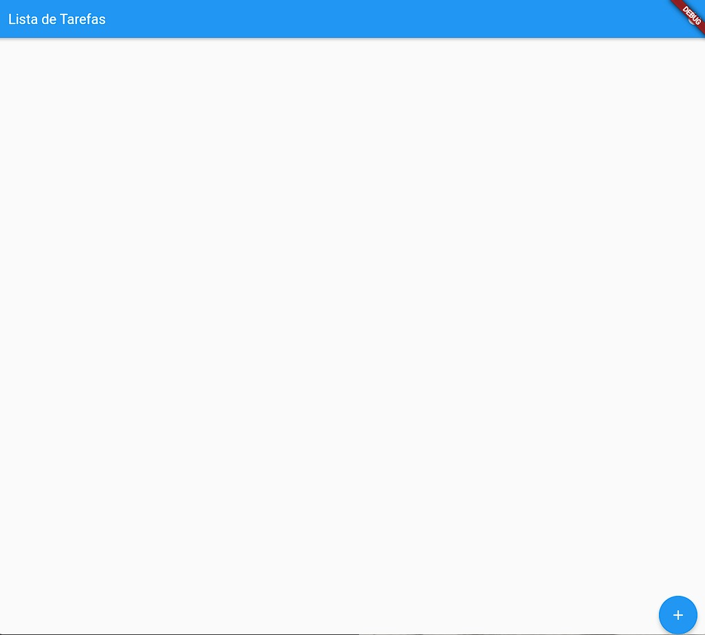
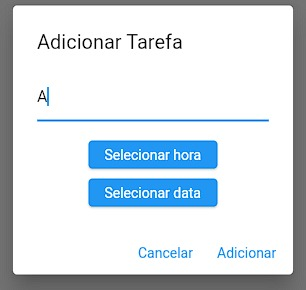
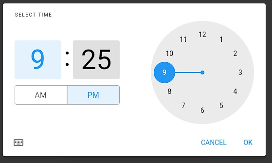
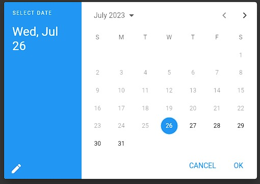
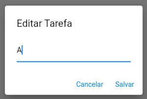
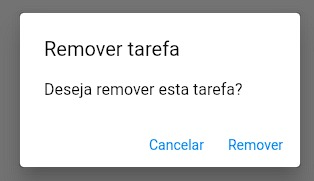
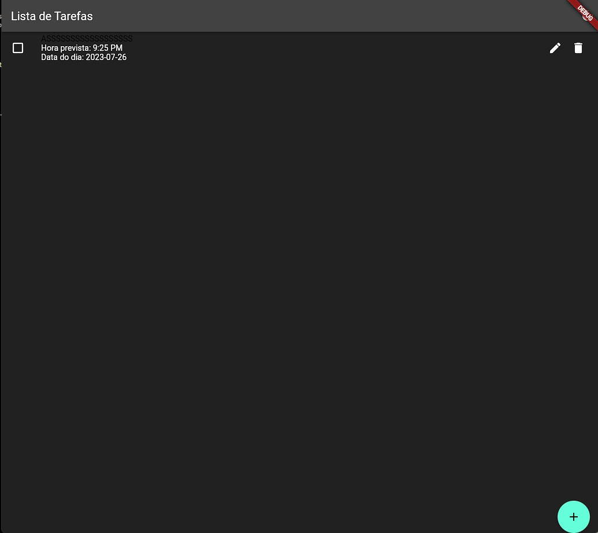
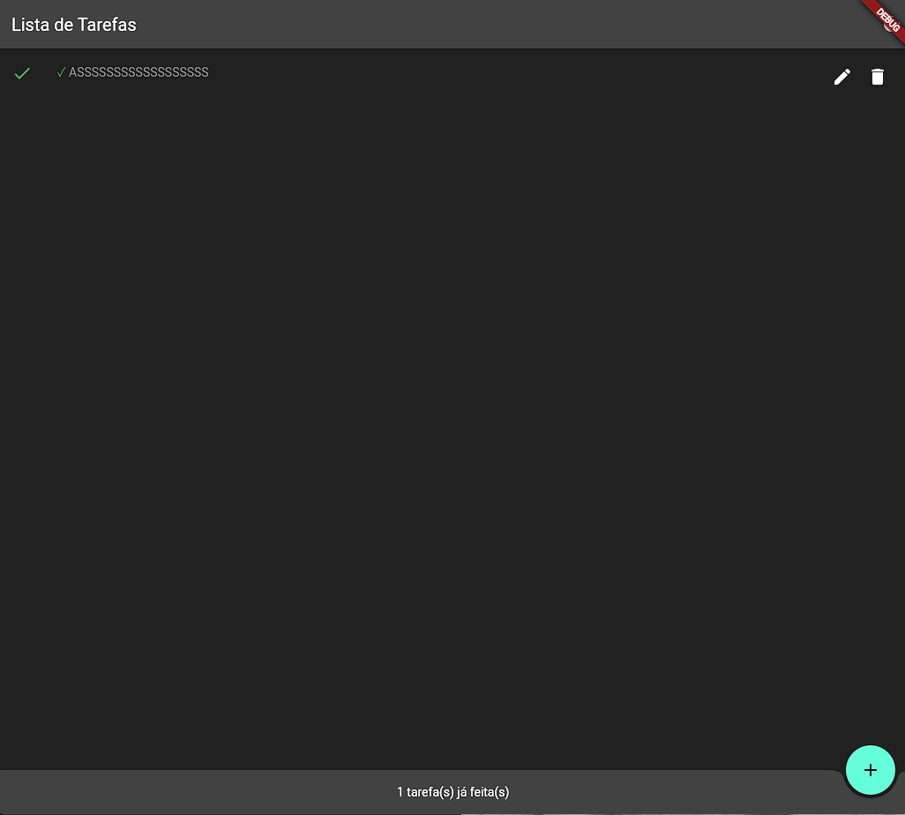

# APLICATIVO DE LISTA DE TAREFAS 

Nosso projeto consiste em um aplicativo de lista de tarefas.

* A tela inicial tem um botão para se adicionar tarefa a fazer ou comprar. 
* Em seguida é possível colocar a data e horário em que essa atividade será feita.
* Depois que a tarefa é criada, é possível editá-la clicando num botão.
* Após conclusão, ela poderá ser marcada como concluída.
* Conta ainda com um botão toggle para dark mode.

